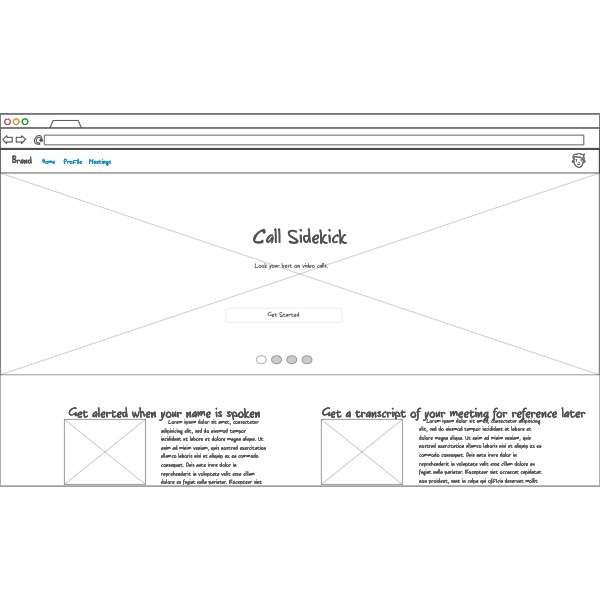
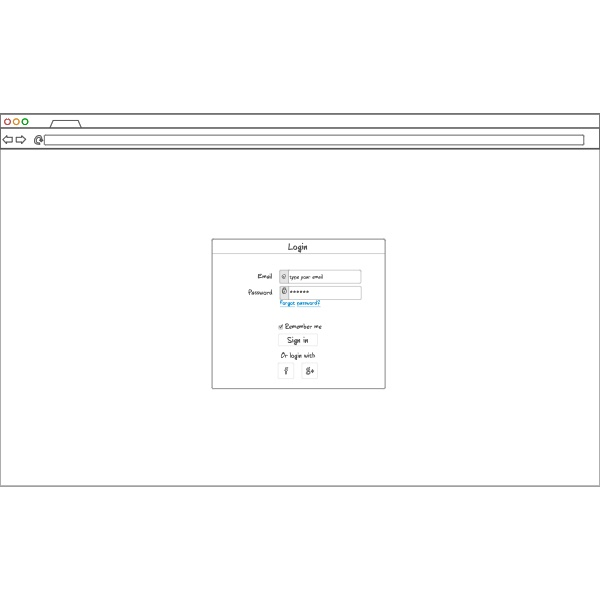
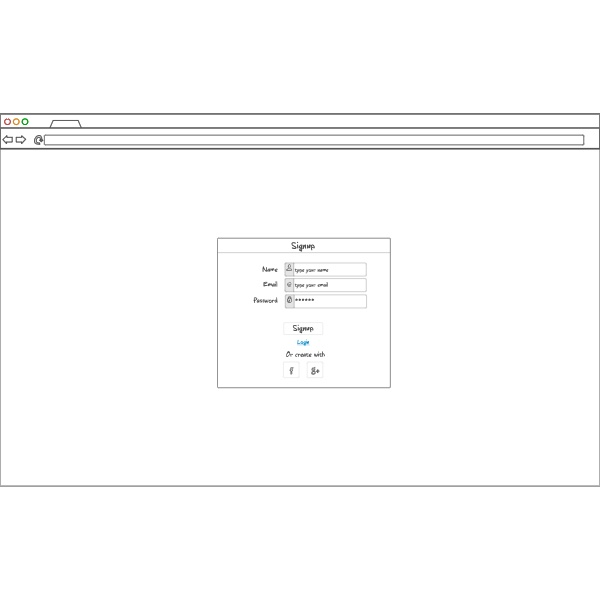
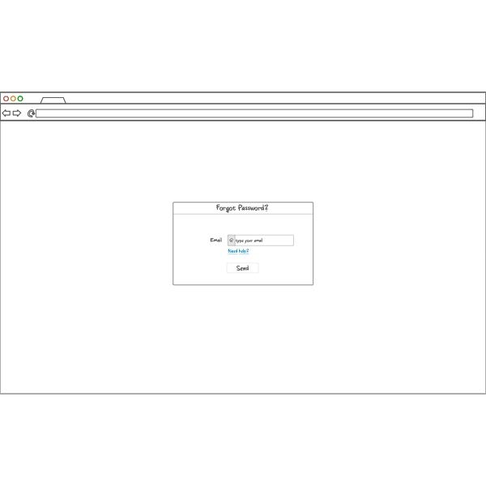
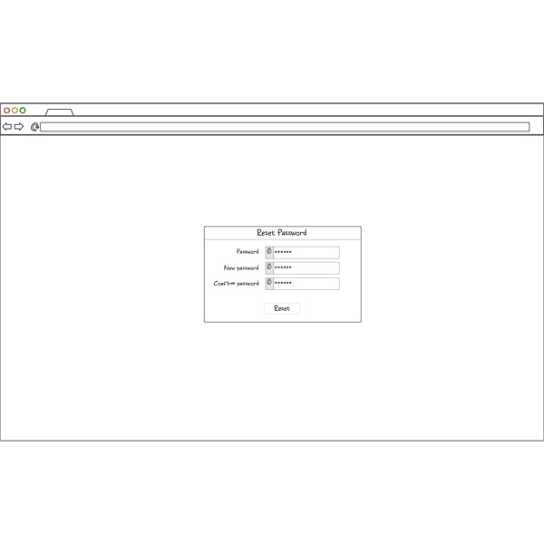
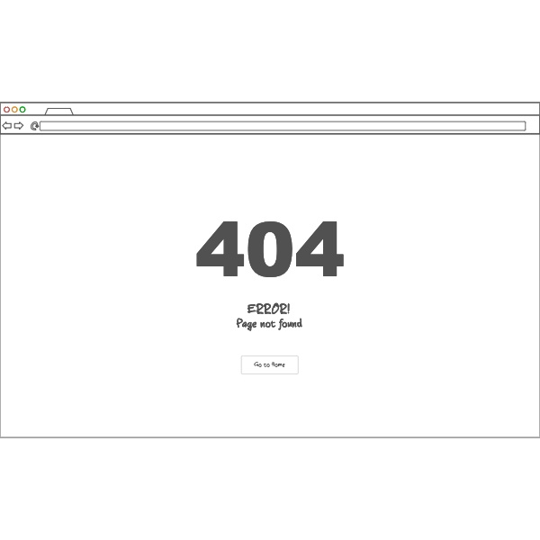
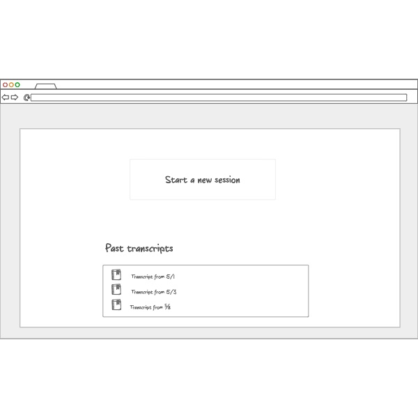
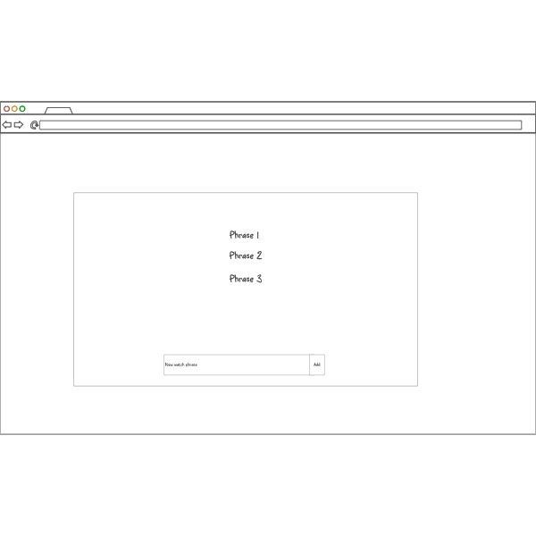

[Class notes are located here](notes.md)
# Callsidekick.app - Boost Your Video Call Productivity

It's hard to appear professional and remain engaged in video calls. **Callsidekick.app** enables users to be more productive during remote calls. Using the screen share audio and microphone audio features in Chromium browsers (as well as Rev AI's realtime speech-to-text API), a live transcript of everything spoken in the call is generated. When the user's name is spoken during the call or when any other watch phrases the user sets are spoken during the call, Callsidekick.app notifies the user and jumps to that location in the transcript. With Callsidekick.app, users can remain attentive during the call and always have the needed context to give thoughtful and confident answers in video calls.

## Key Features

- Secure user authentication and account creation
- Uses screen share audio and microphone audio features in Chromium browsers
- Integration with Rev AI's realtime speech-to-text API to generate transcript of audio
- Automatic notifications and transcript location jumps when user's name or other custom phrases the user chooses to watch for are mentioned in the transcript
- Customizable watch phrases for personalized notifications
- Easy access to previous transcripts and the ability to start new transcript generation sessions
- Real-time audio-to-text conversion using websockets
- Storage of user information, previous transcripts, and notes in the database

### Authentication

Users create accounts and log in to view their previous transcripts or start a new transcript generation session.

### Websockets

Using a web socket, the user sends an audio stream to the server and receives near real-time conversion of that audio as text from the server. The server also creates a websocket with the Rev AI's API to convert the audio to text. Using the text received from the API, the server does some formatting to the text, looks for any watch phrases set by the user, and then passes formatted text along to the user as a transcript of the call.

### Database

Store user information, store previous transcripts, and notes belonging to the user.

## Wireframes
### Homepage

### Login and sign up

### 404 page

### User dashboard

### Call transcript generation page

### Add a new watch phrase popup

# HTML Deliverable
## Properly structured HTML
- HTML pages exist for each component of the application ✅
- HTML pages link between pages as necessary ✅
- Lorem ipsum text added for generated text, other needed text is written into the HTML ✅
- Logo image added to the header of [index.html](/index.html)
- Placeholder for 3rd party service added in [call.html](/call.html) ✅
- A placeholder for logging in and logging out added in [login.html](/login.html) and [signup.html](/signup.html), a placeholder for where the user's name will be displayed in the dashboard after logging in is added in [dashboard.html](/dashboard.html) ✅
- Database data placeholder added to [dashboard.html](/dashboard.html) ✅
- Websocket data placeholder added to [call.html](/call.html) ✅
##
There are multiple Git commits, each with a specific, useful comment attached ✅

# CSS Deliverable
## Properly styled CSS
- Header, footer, and main content body added ✅
- Navigational elements added ✅
- Application elements present ✅
- Application text content present ✅
- Image present (website logo in the header of every page) ✅
## What changed?
Boostrap CSS was added to the pages, boostrap CSS classes added to HTML, some general restructuring of the HTML from the HTML-only version to work with the expected formatting for bootstrap header and footer, changed the call page HTML so that the notes and transcripts would be displayed side-by-side. Some small tweaks to the marketing copy text on the home page.
## 
There are multiple Git commits, each with a specific, useful comment attached ✅